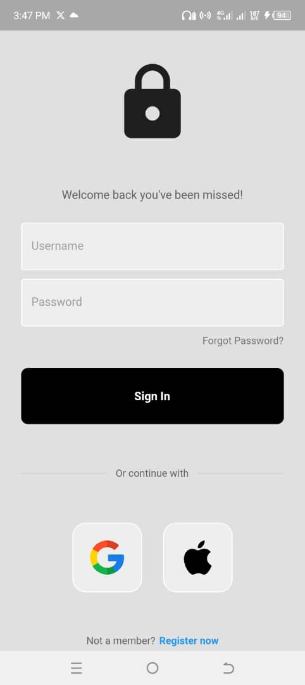
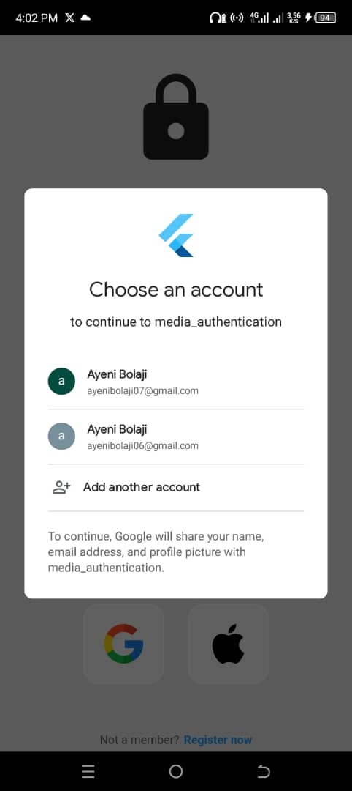
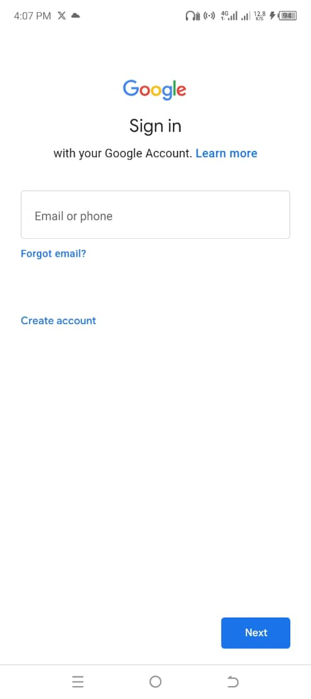
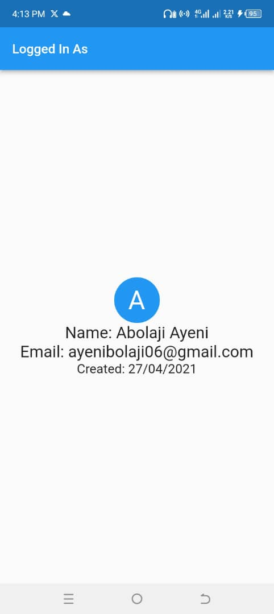

# Social Media Authentication

An online shopping app built with Dart and Flutter

 
Project AboutThis project enhances app security and user access by integrating Google and iOS login authentication methods. These added login options provide an alternative and secure means for users to access the application.

## Packages used:
- google_sign_in
- firebase
- cupertino icons

## screenshots

## Login Screen

## Google Integration

## Profile Screen

